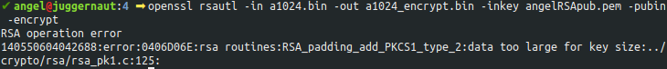

# Práctica 2: Criptosistemas asimétricos

> Ángel Gómez Martín
>
> agomezm@correo.ugr.es
>
> Seguridad y Protección de Sistemas Informáticos
>
> UGR 2018-19


## Tareas

> Para determinar la sintaxis de las ordenes a utilizar me he basado en el [manual de OpenSSL](https://www.openssl.org/docs/man1.1.1/).

### 1

Para generar el par de claves pública y privada usando el algoritmo RSA, en formato PEM, sin contraseña y de 901 bits ejecuto lo siguiente:

```bash
openssl genrsa -out angelRSAkey.pem 901
```

- *genrsa*: Genera la clave con RSA.
- *-out nombre.pem*: Archivo de salida. En este caso formato PEM.
- *size*: Tamaño en bits de la clave. En este caso 901 bits.


### 2

Para extraer la clave privada cifrada con AES-128 utilizo la siguiente orden:

```bash
openssl rsa -in angelRSAkey.pem -out angelRSApriv.pem -aes128
```


- *openssl rsa* es la orden utilizada para manejar claves RSA.
- Como contraseña he utilizado: *0123456789*


### 3

Extraigo la clave pública con la orden siguiente: 

```bash
openssl rsa -in angelRSAkey.pem -out angelRSApub.pem -pubout
```


- *-pubout*: Extrae la clave pública.
- No es necesario añadir -aes128 pues no queremos que la clave pública esté cifrada.


### 4

La orden utilizada es la siguiente:

```bash
openssl rsautl -in a1024.bin -out a1024_encrypt.bin -inkey angelRSApub.pem -pubin -encrypt
```

- *-in archivo*: Archivo de entrada.
- *-out archivo*: Archivo de salida.
- *-inkey key*: Clave usada para cifrar.
- *-pubin*: Indica que se está introduciendo la clave pública.
- *-encrypt*: Indica que se quiere cifrar.




El error que aparece indica que el tamaño del archivo de datos a cifrar es demasiado grande para esta clave. Esto se produce porque para cada tamaño de clave sólo se puede cifrar hasta un tamaño máximo de bytes.

Para calcular este tamaño pasamos a bytes el tamaño de la clave y le restamos un padding (11 bytes PKCS#1 v1.5). En el caso de nuestra clave de 901 bits el tamaño máximo del archivo deberia ser:

901/8 - 11 = 112,625 - 11 = 101,625 ~ 101 bytes.

Puesto que el archivo (*a1024.bin*) pesa 256 bytes (1024 bits), no puede ser cifrado con esta clave.

> Referencias:
>
> https://tls.mbed.org/kb/cryptography/rsa-encryption-maximum-data-size
>
> https://tools.ietf.org/html/rfc2313


### 5

#### 	1

Como criptosistema simétrico elijo AES-192-OFB. La elección ha sido arbitraria pues ha sido el primer criptosistema que he visto al revisar la práctica anterior.

#### 	2

Genero el archivo sessionkey con la siguiente orden:

```bash
openssl rand -out sessionkey -hex 24 
```

- *rand*: Para generar una cadena aleatoria.
- *-out archivo*: Archivo de salida.
- *-hex*: Cadena en hexadecimal.
- *bytes*: Tamaño en bytes de la cadena. En este caso 24, pues AES-192-OFB necesita una clave de 192 bits (24 bytes).

Modifico el archivo *sessionkey* y le añado *-aes-192-ofb*.


#### 	3

Para cifrar el archivo *sessionkey* utilizo la orden siguiente (es la misma que se usa para cifrar el archivo *a1024.bin*):

```bash
openssl rsautl -in sessionkey -out sessionkey_crypt -inkey angelRSApub.pem -pubin -encrypt
```


#### 	4

La orden usada para cifrar el archivo *a1024.bin* usando el criptosistema simétrico es la siguiente:

```bash
openssl enc -aes-192-ofb -in a1024.bin -out a1024_crypt.bin -pass file:sessionkey
```


### 6

Utilizo la orden anterior para cifrar el archivo *a1024.bin*, obteniendo el siguiente resultado:


En la anterior imagen se puede observar el archivo cifrado usando el sistema simétrico que he creado en el ejercicio anterior. Ahora paso a descifrar el archivo con la clave privada para ver si coincide con el archivo original.

En primer lugar descrifro el archivo *sessionkey_crypt*, que es el que me permitirá descifrar el mensaje, para ello utilizo la siguiente orden:

```bash
openssl rsautl -in sessionkey_crypt -out sessionkey_decrypt -inkey angelRSApriv.pem -decrypt
```


Al descifrar usando la clave privada se necesita una contraseña, ésta es la cifra dicha clave (la que puse en el ejercicio 2). Por otro lado se observa que el archivo *sessionkey_decrypt* se ha descifrado correctamente.

Ahora utilizando este archivo puedo descifrar el archivo *a1024_crypt.bin* para ver si coincide con el original; para ello uso la orden que usaba en el ejercicio 5.4, pero cambiando algunos flags:

```bash
openssl enc -aes-192-ofb -d -in a1024_crypt.bin -out a1024_decrypt.bin -pass file:sessionkey_decrypt
```

- *-d*: Indica que queremos descifrar.

El archivo (*a1024_crypt.bin*) se descifra correctamente (en *a1024_decrypt.bin*) y vemos que contiene el mismo contenido que el archivo original (*a1024.bin*)


### 7

La curva que he elegido es B-163, que corresponde en OpenSSL con *sect163k1*. Para generar el archivo *stdECparam.pem* uso la orden siguiente:

```bash
openssl ecparam -name sect163k1 -out stdECparam.pem
```

- *-name*: Nombre de la curva elíptica.


> Referencias:
>
> - [http://www.secg.org/SEC2-Ver-1.0.pdf](http://www.secg.org/SEC2-Ver-1.0.pdf)
> - [https://wiki.openssl.org/index.php/Command_Line_Elliptic_Curve_Operations](https://wiki.openssl.org/index.php/Command_Line_Elliptic_Curve_Operations)


### 8

Para generar la clave a partir del archivo anterior (*stdECparam.pem*) creado utilizo la siguiente orden:

```bash
openssl ecparam -in stdECparam.pem -out angelECkey.pem -genkey
```


Al generar la clave se observa que también se ha incluído la curva elíptica. Para evitar esto agrego *-noout* a la orden anterior.

```bash
openssl ecparam -in stdECparam.pem -out angelECkey.pem -genkey -noout
```


> Referencias: [https://wiki.openssl.org/index.php/Command_Line_Elliptic_Curve_Operations](https://wiki.openssl.org/index.php/Command_Line_Elliptic_Curve_Operations)


### 9

Del mismo modo que lo hacía en el ejercicio 2 extraigo y cifro la clave privada con AES-128

```bash
openssl ec -in angelECkey.pem -out angelECpriv.pem -aes128
```


Como contraseña utilizo la que se sugiere en el guión de la práctica: *0123456789*


> Referencias: [https://wiki.openssl.org/index.php/Command_Line_Elliptic_Curve_Operations](https://wiki.openssl.org/index.php/Command_Line_Elliptic_Curve_Operations)


### 10

Para extraer la clave pública lo hago del mismo modo que lo hice en el ejercicio 3:

```bash
openssl ec -in angelECkey.pem -out angelECpub.pem -pubout
```


> Referencias: [https://wiki.openssl.org/index.php/Command_Line_Elliptic_Curve_Operations](https://wiki.openssl.org/index.php/Command_Line_Elliptic_Curve_Operations)


