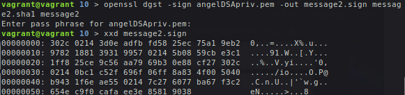
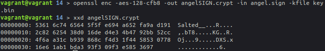
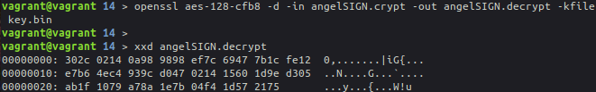

# Práctica 3: Protocolos criptográficos

> Ángel Gómez Martín
>
> agomezm@correo.ugr.es
>
> Seguridad y Protección de Sistemas Informáticos
>
> UGR 2018-19


## Tareas

> Para determinar la sintaxis de las ordenes a utilizar me he basado en el [manual de OpenSSL](https://www.openssl.org/docs/man1.1.1/).


### 1

Para generar el archivo utilizo la siguiente orden:

```bash
openssl dsaparam -out sharedDSA.pem 1024
```

- *-out*: Fichero de salida.
- *1024*: Tamaño de la clave.


Por otro lado si queremos ver los valores generados (*P, Q y G*) uso la orden siguiente:

```bash
openssl dsaparam -in sharedDSA.pem -noout -text
```

- *-in*: Archivo de entrada.
- *-noout*: No devuelve el resultado en un archivo.
- *-text*: Devuelve el resultado por pantalla en hexadecimal.


### 2

Para generar el par de claves uso las siguientes ordenes:

```bash
openssl gendsa -out angelDSAkey.pem sharedDSA.pem
openssl gendsa -out gomezDSAkey.pem sharedDSA.pem
```

- *-out*: Archivo de salida.
- *sharedDSA.pem*: Archivo del cual se toman los parámetros para generar las claves.


Y también sus parámetros:


### 3

> La contraseña utilizada para el cifrado ha sido: 0123456789

Del mismo modo que se hacía en prácticas anteriores, la sintaxis del comando para extraer la clave privada es muy similar en el caso de DSA, en este caso es el siguiente:

```bash
openssl dsa -in angelDSAkey.pem -out angelDSApriv.pem -aes256
openssl dsa -in gomezDSAkey.pem -out gomezDSApriv.pem -aes256
```

- *-in*: Archivo de entrada.
- *-out*: Archivo de salida.
- *-aes256*: Método de cifrado.


### 4

La orden para extraer la clave pública tiene la misma forma que el usado en la práctica anterior, es el siguiente:

```bash
openssl dsa -in angelDSAkey.pem -out angelDSApub.pem -pubout
openssl dsa -in gomezDSAkey.pem -out gomezDSApub.pem -pubout
```

- *-in*: Archivo de entrada.
- *-out*: Archivo de salida.
- *-pubout*: Indica que se extrae la clave pública.


### 5

El archivo *message* que he creado se trata de un fichero de texto plano de 128 bytes con ceros en su interior.


### 6

> Debido a un bug de la versión 1.1.0g de OpenSSL que daba un error al firmar ficheros desde este ejercicio en adelante utilizo una máquina virtual con LibreSSL v2.1.6.

Para firmar el mensaje uso la siguiente orden:

```bash
openssl pkeyutl -sign -inkey angelDSApriv.pem -in message -out message.sign
```

- *-sign*: Firmar el mensaje.
- *-inkey*: Clave privada usada para firmar.
- *-in*: Archivo de entrada.
- *-out*: Archivo de salida.


### 7

El archivo que he usado se trata del mismo que el generado en el ejercicio 5, pero en lugar de contener todo ceros contiene cinco unos al final.


Y ahora compruebo que la verificación sea correcta:

```bash
openssl pkeyutl -verify -pubin -inkey angelDSApub.pem -in message -sigfile message.sign
```

- *-verify*: Verificar el archivo de entrada con la firma.
- *-pubin*: Clave pública de entrada.
- *-inkey*: Archivo con la clave pública.
- *-in*: Archivo de entrada.
- *-sigfile*: Archivo con la firma.


La verificación es correcta porque aunque se añadan mas bytes al final del archivo la firma está realizada para los mismos primeros bytes. Al verificar se comprueban los bytes que se firmaron al crear la firma, al ser los mismos la verificación es correcta.


### 8

Genero el hash de la clave pública usando sha384 de la siguiente manera:

```bash
openssl dgst -sha384 -hex -c -out angelDSApub.sha384 angelDSApub.pem
```

- *-sha384*: Algoritmo usado para calcular hash.
- *-hex*: Salida en hexadecimal.
- *-c*: Salida por pares de dígitos separados por dos puntos.
- *-out*: Archivo de salida.
- *angelDSApub.pem*: Clave pública de entrada.


### 9

> Aunque en el ejercicio 7 el archivo modificado se llama *message*, lo renombro como *message2* para realizar el resto de ejercicios y así utilizar la nomenclatura del guión de prácticas.
>

Calculo el valor hash de *message2* de una forma muy similar al ejercicio anterior:

```bash
openssl dgst -sha1 -binary -out message2.sha1 message2
```

- *-sha1*: Algoritmo usado para calcular hash. He elegido *sha1* porque devuelve una salida de 160 bits, aunque también podría haber usado *sha0*, que también devuelve una salida de 160 bits.
- *-binary*: Devuelve la salida en formato binario.
- *-out*: Archivo de salida.
- *message2*: Archivo de entrada.


### 10

Firmo el archivo *message2* con la firma anterior (*message2.sha1*) con la siguiente orden:

```bash
openssl dgst -sign angelDSApriv.pem -out message2.sign message2.sha1 message2
```

- *-sign*: Firmar usando la clave privada.
- *-out*: Archivo de salida.
- *message2.sha1*: Entrada del hash.
- *message2*: Entrada del archivo a firmar.




### 11

La orden para verificar es la siguiente:

```bash
openssl dgst -verify angelDSApub.pem -signature message2.sign message
openssl dgst -verify angelDSApub.pem -signature message2.sign message2
```

Obtengo los siguientes errores:


En el primer caso se produce (creo) porque estoy intentando verificar el mensaje con una firma generada a partir de otro archivo, que aunque comparten la mayoria de bits, no son exactamente iguales.

Por otro lado no entiendo el segundo error, pues al tratarse de una firma obtenida a partir de *message2* debería verificarse correctamente.


### 12

```bash
openssl pkeyutl -verify -pubin -inkey angelDSApub.pem -in message2 -sigfile message2.sign
```


En este caso el error se produce (creo) porque estoy intentando verificar con una firma obtenida a partir del hash *sha1* del archivo, por lo que no usa en absoluto la clave pública o privada de *angel*.


### 13

El comando que he usado para generar el valor HMAC de *sharedDSA.pem* es el siguiente:

```bash
openssl dgst -hmac 12345 sharedDSA.pem
```

- *-hmac 12345*: Crear hashed MAC usando como clave *12345*.
- *sharedDSA.pem*: Archivo de entrada.


### 14

En primer lugar genero el par de claves pública y privada asociadas a una curva elíptica para ambos usuarios (pues ahora uso una máquina virtual y he obtenido fallos usando las claves generadas anteriormente). Lo hago del mismo modo que en la práctica anterior.

Elijo la curva B-163, que corresponde con *sect163k1* en OpenSSL.

```bash
openssl ecparam -name sect163k1 -out stdECparam.pem
```


Genero la clave a partir de la curva...

```bash
openssl ecparam -in stdECparam.pem -out angelECkey.pem -genkey -noout
openssl ecparam -in stdECparam.pem -out gomezECkey.pem -genkey -noout
```


... y extraigo las claves privadas y públicas:

```bash
# Claves privadas:
openssl ec -in angelECkey.pem -out angelECpriv.pem -aes128
openssl ec -in gomezECkey.pem -out gomezECpriv.pem -aes128

# Claves públicas:
openssl ec -in angelECkey.pem -out angelECpub.pem -pubout
openssl ec -in gomezECkey.pem -out gomezECpub.pem -pubout
```

> Pass usado: 0123456789


Ahora cada usuario genera su clave generada:

```bash
openssl pkeyutl -inkey angelECpriv.pem -peerkey gomezECpub.pem -derive -out angelKEY.bin
openssl pkeyutl -inkey gomezECpriv.pem -peerkey angelECpub.pem -derive -out gomezKEY.bin
```


Se observa que ambas KEYs son iguales, por lo que renombro una de ellas a *key.bin* para usar la nomenclatura del guión.


#### Procedimiento:

Primero, *angel* concatena la clave pública de *gomez* con la suya:

```bash
cat gomezECpub.pem angelECpub.pem > gomezangel.pub
```


Ahora *angel* firma con su clave privada DSA el archivo anterior.

```bash
openssl dgst -out angel.sign -sign angelDSApriv.pem gomezangel.key
```


Tras esto *angel* encripta el archivo firmado con la clave derivada y se la envía a *gomez*:

```bash
openssl enc -aes-128-cfb8 -out angelSIGN.crypt -in angel.sign -kfile key.bin
```




*gomez* desencripta el archivo...

```bash
openssl aes-128-cfb8 -d -in angelSIGN.crypt -out angelSIGN.decrypt -kfile key.bin
```




... y verifica:

```bash
openssl dgst -verify angelDSApub.pem -signature angelSIGN.decrypt gomezangel.pub
```


Por otro lado, el usuario gomez realiza el mismo proceso. En primer lugar concatena ambas claves (EC) públicas. 

```bash
cat angelECpub.pem gomezECpub.pem > angelgomez.pub
```


Ahora firma el archivo anterior:

```bash
openssl dgst -out gomez.sign -sign gomezDSApriv.pem angelgomez.pub
```


Tras firmarlo, lo cifra y se lo envía a *angel*:

```bash
openssl enc -aes-128-cfb8 -out gomezSIGN.crypt -in gomez.sign -kfile key.bin
```


*angel* lo desencripta:

```bash
openssl aes-128-cfb8 -d -in gomezSIGN.crypt -out gomezSIGN.decrypt -kfile key.bin
```


Y finalmente lo verifica:

```bash
openssl dgst -verify gomezDSApub.pem -signature gomezSIGN.decrypt angelgomez.pub
```


Habiendo obtenido ambos usuarios una verificación correcta, ya saben que la clave derivada (*K*) sólo está compartida entre ellos dos.


