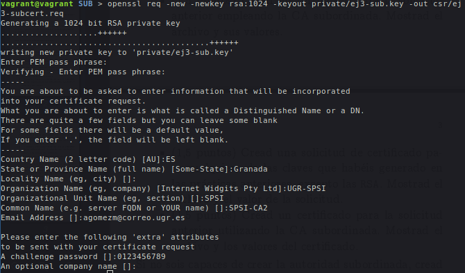
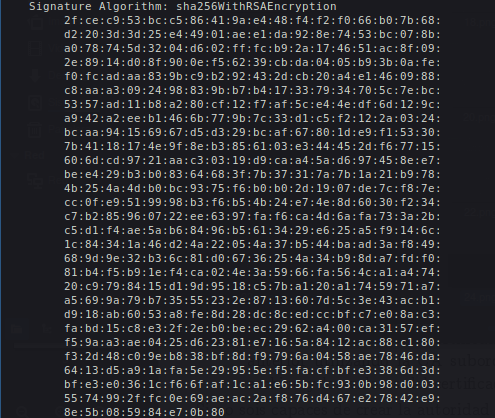

# Práctica 4: Certificados digitales

> Ángel Gómez Martín
>
> agomezm@correo.ugr.es
>
> Seguridad y Protección de Sistemas Informáticos
>
> UGR 2018-19


## Tareas

> Para determinar la sintaxis de las ordenes a utilizar me he basado en el [manual de OpenSSL](https://www.openssl.org/docs/man1.1.1/).
>
> Otras referencias:
>
> - https://blog.guillen.io/2018/09/29/crear-autoridad-certificadora-ca-y-certificados-autofirmados-en-linux/
> - http://www.juanluramirez.com/crear-autoridad-certificadora-ssl/
> - https://www.bdat.net/documentos/certificados_digitales/x309.html
> - https://www.question-defense.com/2009/09/22/use-openssl-to-verify-the-contents-of-a-csr-before-submitting-for-a-ssl-certificate


### 1

En primer lugar preparo el directorio que voy a usar para la entidad certificadora:

```bash
# Creo el directorio principal donde se almacenará la CA.
mkdir CA
cd CA

# Creo los directorios necesarios.
mkdir certs crl newcerts private
chmod 700 private

# Creo los archivos necesarios para la BD de la CA.
touch index.txt
echo 1000 > serial
```


Tras esto creo el archivo *openssl.cnf* y configuro los parámetros para la CA:

```bash
# Copio el archivo.
touch openssl.cnf

# Configuro los parámetros del archivo para que quede de la siguiente forma:
[ ca ]
default_ca = CA_default
 
[ CA_default ]
dir               = .
certs             = $dir/certs
crl_dir           = $dir/crl
new_certs_dir     = $dir/newcerts
database          = $dir/index.txt
serial            = $dir/serial
RANDFILE          = $dir/private/.rand
 
private_key       = $dir/private/ca.key.pem
certificate       = $dir/certs/ca.cert.pem
 
crlnumber         = $dir/crlnumber
crl               = $dir/crl/ca.crl.pem
crl_extensions    = crl_ext
default_crl_days  = 30
 
default_md        = sha256
 
name_opt          = ca_default
cert_opt          = ca_default
default_days      = 375
preserve          = no
policy            = policy_strict
 
[ policy_strict ]
countryName             = match
stateOrProvinceName     = match
organizationName        = match
organizationalUnitName  = optional
commonName              = supplied
emailAddress            = optional
 
[ policy_loose ]
countryName             = optional
stateOrProvinceName     = optional
localityName            = optional
organizationName        = optional
organizationalUnitName  = optional
commonName              = supplied
emailAddress            = optional
 
[ req ]
default_bits        = 2048
distinguished_name  = req_distinguished_name
string_mask         = utf8only
 
default_md          = sha256
 
x509_extensions     = v3_ca
 
[ req_distinguished_name ]
countryName                     = Country Name (2 letter code)
stateOrProvinceName             = State or Province Name
localityName                    = Locality Name
0.organizationName              = Organization Name
organizationalUnitName          = Organizational Unit Name
commonName                      = Common Name
emailAddress                    = Email Address
 
[ v3_ca ]
subjectKeyIdentifier = hash
authorityKeyIdentifier = keyid:always,issuer
basicConstraints = critical, CA:true
keyUsage = critical, digitalSignature, cRLSign, keyCertSign
 
[ v3_intermediate_ca ]
subjectKeyIdentifier = hash
authorityKeyIdentifier = keyid:always,issuer
basicConstraints = critical, CA:true, pathlen:0
keyUsage = critical, digitalSignature, cRLSign, keyCertSign
 
[ usr_cert ]
basicConstraints = CA:FALSE
nsCertType = client, email
nsComment = "OpenSSL Generated Client Certificate"
subjectKeyIdentifier = hash
authorityKeyIdentifier = keyid,issuer
keyUsage = critical, nonRepudiation, digitalSignature, keyEncipherment
extendedKeyUsage = clientAuth, emailProtection
 
[ server_cert ]
basicConstraints = CA:FALSE
nsCertType = server
nsComment = "OpenSSL Generated Server Certificate"
subjectKeyIdentifier = hash
authorityKeyIdentifier = keyid,issuer:always
keyUsage = critical, digitalSignature, keyEncipherment
extendedKeyUsage = serverAuth
 
[ crl_ext ]
authorityKeyIdentifier=keyid:always
 
[ ocsp ]
basicConstraints = CA:FALSE
subjectKeyIdentifier = hash
authorityKeyIdentifier = keyid,issuer
keyUsage = critical, digitalSignature
extendedKeyUsage = critical, OCSPSigning
```


Ahora creo la clave de la entidad certificadora:

```bash
# Genero clave.
# Como pass utilizo: 0123456789
openssl genrsa -aes256 -out private/ca.key.pem 4096

# Le cambio los permisos
chmod 400 private/ca.key.pem
```


Creo ahora el certificado de la entidad certificadora:

```bash
# Creo certificado:
openssl req -config openssl.cnf -key private/ca.key.pem -new -x509 -days 7300 -sha256 -extensions v3_ca -out certs/ca.cert.pem

# Cambio permisos del certificado:
chmod 444 certs/ca.cert.pem
```


Verifico el certificado:

```bash
openssl x509 -noout -text -in certs/ca.cert.pem
```


Habiendo comprobado que la verificación es correcta sabemos que la entidad certificadora está creada correctamente.


### 2

Para crear una entidad subordinada primero preparo el entorno:

```bash
# Directorio para la CA subordinada
mkdir SUB

mkdir certs crl csr newcerts private
chmod 700 private
touch index.txt
echo 1000 > serial
```


Ahora creo el archivo de configuración, que tiene la siguiente forma:

```bash
[ ca ]
default_ca = CA_default
 
[ CA_default ]
dir               = .
certs             = $dir/certs
crl_dir           = $dir/crl
new_certs_dir     = $dir/newcerts
database          = $dir/index.txt
serial            = $dir/serial
RANDFILE          = $dir/private/.rand

private_key       = $dir/private/sub.key.pem
certificate       = $dir/certs/sub.cert.pem
 
crlnumber         = $dir/crlnumber
crl               = $dir/crl/sub.crl.pem
crl_extensions    = crl_ext
default_crl_days  = 30
 
default_md        = sha256
 
name_opt          = ca_default
cert_opt          = ca_default
default_days      = 375
preserve          = no
policy            = policy_loose
 
[ policy_strict ]
countryName             = match
stateOrProvinceName     = match
organizationName        = match
organizationalUnitName  = optional
commonName              = supplied
emailAddress            = optional
 
[ policy_loose ]
countryName             = optional
stateOrProvinceName     = optional
localityName            = optional
organizationName        = optional
organizationalUnitName  = optional
commonName              = supplied
emailAddress            = optional
 
[ req ]
default_bits        = 2048
distinguished_name  = req_distinguished_name
string_mask         = utf8only
 
default_md          = sha256
 
x509_extensions     = v3_ca
 
[ req_distinguished_name ]
countryName                     = Country Name (2 letter code)
stateOrProvinceName             = State or Province Name
localityName                    = Locality Name
0.organizationName              = Organization Name
organizationalUnitName          = Organizational Unit Name
commonName                      = Common Name
emailAddress                    = Email Address

 
[ v3_ca ]
subjectKeyIdentifier = hash
authorityKeyIdentifier = keyid:always,issuer
basicConstraints = critical, CA:true
keyUsage = critical, digitalSignature, cRLSign, keyCertSign
 
[ v3_intermediate_ca ]
subjectKeyIdentifier = hash
authorityKeyIdentifier = keyid:always,issuer
basicConstraints = critical, CA:true, pathlen:0
keyUsage = critical, digitalSignature, cRLSign, keyCertSign
 
[ usr_cert ]
basicConstraints = CA:FALSE
nsCertType = client, email
nsComment = "OpenSSL Generated Client Certificate"
subjectKeyIdentifier = hash
authorityKeyIdentifier = keyid,issuer
keyUsage = critical, nonRepudiation, digitalSignature, keyEncipherment
extendedKeyUsage = clientAuth, emailProtection
 
[ server_cert ]
basicConstraints = CA:FALSE
nsCertType = server
nsComment = "OpenSSL Generated Server Certificate"
subjectKeyIdentifier = hash
authorityKeyIdentifier = keyid,issuer:always
keyUsage = critical, digitalSignature, keyEncipherment
extendedKeyUsage = serverAuth
 
[ crl_ext ]
authorityKeyIdentifier=keyid:always
 
[ ocsp ]
basicConstraints = CA:FALSE
subjectKeyIdentifier = hash
authorityKeyIdentifier = keyid,issuer
keyUsage = critical, digitalSignature
extendedKeyUsage = critical, OCSPSigning
```


Tras esto, creo el la clave privada necesaria:

```bash
openssl genrsa -aes256 -out private/sub.key.pem 4096

# Modifico sus permisos
chmod 400 private/sub.key.pem
```


Y ahora creo el certificado intermedio desde el directorio de la CA principal:

```bash
openssl req -config SUB/openssl.cnf -new -sha256 -key SUB/private/sub.key.pem -out SUB/csr/sub.csr.pem
```


Ahora se valida el certificado firmándolo:

```bash
openssl ca -config openssl.cnf -extensions v3_intermediate_ca -days 3650 -notext -md sha256 -in SUB/csr/sub.csr.pem -out SUB/certs/sub.cert.pem
```


Compruebo la entidad subordinada:

```bash
openssl verify -CAfile certs/ca.cert.pem SUB/certs/sub.cert.pem
```


Por último concateno los certificados:

```bash
cat SUB/certs/sub.cert.pem certs/ca.cert.pem > SUB/certs/ca-chain.cert.pem

# Cambio los permisos del archivo creado
chmod 444 SUB/certs/ca-chain.cert.pem
```


Tras estos pasos ya quedaría creada la CA subordinada.


### 3

> Como contraseña de cifrado de la clave que se genera he usado: 0123456789

El comando para crear la solicitud generando también claves es el siguiente:

```bash
openssl req -new -newkey rsa:1024 -keyout private/ej3.key -out csr/ej3cert.req
```

- *-new*: Crear nueva solicitud.
- *-newkey rsa:1024*: Tipo de clave.
- *-keyout private/ej3.key*: Archivo de salida que contendrá la clave. 
- *-out csr/ej3cert.req*: Archivo de salida que contendrá la solicitud.


Por otro lado para ver el contenido de la solicitud utilizo el comando:

```bash
openssl req -noout -text -in csr/ej3cert.req
```


### 4

> Como contraseña de cifrado de la clave que se genera he usado: 0123456789

Para crear una solicitud en la entidad subordinada sigo los mismos paso que en el ejercicio anterior, pero en este caso dentro del directorio donde se encuentra dicha entidad.


En primer lugar creo la solicitud:

```bash
openssl req -new -newkey rsa:1024 -keyout private/ej3-sub.key -out csr/ej3-subcert.req
```




Y tras esto compruebo sus valores:

```bash
openssl req -noout -text -in csr/ej3-subcert.req
```


Ahora genero el certificado, para ello firmo la solicitud que acabo de crear:

```bash
openssl ca -config ./openssl.cnf -days 365 -notext -md sha256 -in csr/ej3-subcert.req -out newcerts/ej3-subcert.cert.pem
```

- -config ./openssl.cnf*: Archivo de configuración a usar.
- *-days 356*: Días para los que es válido el certificado.
- *-md sha256*: Tipo de Message Digest.
- *-in csr/angelcert.req*: Archivo de entrada con la solicitud de certificado.
- *-out newcerts/angelsub.cert.pem*: Archivo de salida con el certificado firmado.


Y compruebo sus valores:





### 5

Para este ejercicio he tomado la clave *angelDSAkey.pem*, generada en la práctica anterior, la cual tiene el siguiente contenido:

```bash
openssl dsa -in angelDSAkey.pem -noout -text
```


En este caso, como ya tenemos la clave, modifico el comando usado en los ejercicios anteriores para que no genere una clave y en su lugar utilice una existente:

```bash
openssl req -new -key private/angelDSAkey.pem -out csr/angelcert.req
```


Y muestro sus valores:

```bash
openssl req -noout -text -in csr/angelcert.req
```


### 6

En primer lugar creo la solicitud del mismo modo que lo hice en el ejercicio anterior, pero en la entidad subordinada:


Genero la solicitud:

```bash
openssl req -new -key private/angelDSAkey.pem -out csr/angelcert.req
```


Muestro sus valores:

```bash
openssl req -noout -text -in csr/angelcert.req
```


Y ahora firmo la solicitud para completar el certificado:

```bash
openssl ca -config ./openssl.cnf -days 365 -notext -md sha256 -in csr/angelcert.req -out newcerts/angelsub.cert.pem 
```

- *-config ./openssl.cnf*: Archivo de configuración a usar.
- *-days 356*: Días para los que es válido el certificado.
- *-md sha256*: Tipo de Message Digest.
- *-in csr/angelcert.req*: Archivo de entrada con la solicitud de certificado.
- *-out newcerts/angelsub.cert.pem*: Archivo de salida con el certificado firmado.


Y finalmente compruebo sus valores:

```bash
openssl x509 -noout -text -in newcerts/angelsub.cert.pem
```


