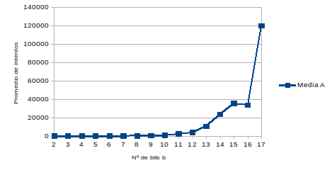
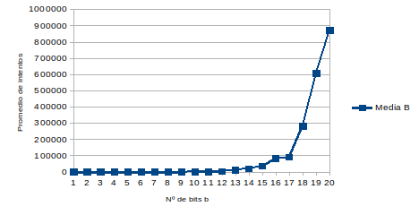
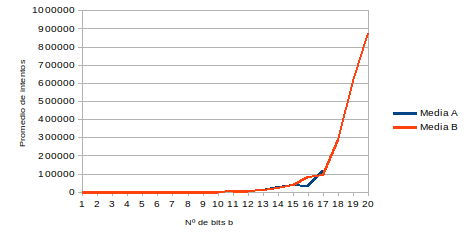

# Práctica 5: Puzzles hash

> Ángel Gómez Martín
>
> agomezm@correo.ugr.es
>
> Seguridad y Protección de Sistemas Informáticos
>
> UGR 2018-19


## Tareas

> He utilizado Python para realizar los scripts necesarios.
>


### 1

El código que he escrito es el siguiente:

```python
import hashlib, secrets, time, random, csv, string, codecs

#   Genera cadena aleatoria de bits de tamaño n
def bitGenerator(n):
    cadena = ""

    for i in range(0, n):
        cadena += str(random.randint(0,1))
    
    return int(cadena, base=2)

#   msj = texto
#   b   = nº bits que tienen que ser 0
#   k   = cadena de n bits
def findZeros(msj, b, k):

    #   Nº de bits de la cadena k
    kbits = len(k) * 8
    # print("kbits:", kbits)

    #   ID
    identifier = msj + k
    # print("identifier:", identifier)

    #   Nº intento
    ntry = 0

    #   Cadena encontrada?
    found = False

    #   Data
    data = {}

    #   Mientras no encuentre el hash correcto
    while not found:
        #   Aumento el número de intentos
        ntry += 1

        #   Genero cadena aleatoria de bits
        token = bitGenerator(kbits)
        # print("token:", token)

        #   Creo nuevo identificador usando el anterior y el token generado
        newid = identifier + str(token)

        #   Calculo su hash
        hashed_newid = hashlib.sha256(newid.encode('utf8')).hexdigest()
        
        #   Paso a binario el hash y le quito los 2 primeros bits (que indican que se encuentra en binario)
        binary_hash = bin(int(hashed_newid, 16))[2:].zfill(256)

        #   Si los b primeros caracteres son 0...
        if (int(binary_hash[0:b],2) == 0):
            #   Se ha encontrado el hash
            found = True

            #   Diccionario con la información
            data = {
                'bloque': identifier,
                'cadena': token,
                'hash': hashed_newid,
                'zeros': b,
                'intentos': ntry
            }

    return data
```


### 2

Función que genera las 10 primeras iteraciones del blockchain:

```python
def ej2():
    #   Creo y abro un archivo .csv para almacenar los datos
    with open('ej2.csv', 'w', newline='') as f:
        fieldnames = ['bloque', 'cadena', 'hash', 'zeros', 'intentos']
        writer = csv.DictWriter(f, fieldnames=fieldnames)
        writer.writeheader()

        #   Mensaje
        msj = 'angel'

        #   Cadena k aleatoria
        cadenaK = ''.join(random.choice(string.ascii_uppercase + string.digits + string.ascii_lowercase) for _ in range(10))
        
        #   Nº de bits a buscar
        b = 2

        #   Primera iteración
        data = findZeros(msj, b, cadenaK)
        
        #   Guardo el hash encontrado como nueva cadena K
        cadenaK = data['hash']

        #    Escribo datos en el archivo
        writer.writerow(data)

        #   Siguientes 9 iteraciones del blockchain
        for i in range(9):
            data = findZeros(msj, b, cadenaK)
            cadenaK = data['hash']
            writer.writerow(data)
```


Resultados obtenidos:

| Bits b | Intentos |                             Hash                             |
| :----: | :------: | :----------------------------------------------------------: |
|   2    |    5     | 05242a3d736b26b2206680d97af792b66b2c807a84c0e32c8e9386744beb74fd |
|   2    |    2     | 2d969688ca5990b10866d80a5157acb5a8b47146a86ba00918f3c87295257fa9 |
|   2    |    5     | 1ca38591b48ec9a626fef6ac0ec81056a18aeeafe22c62aac8ea00d250da14dc |
|   2    |    1     | 1150e89c7cf2bc507675bcca4152bb513f019dd135f4a579a2b23a8d1917d06d |
|   2    |    1     | 27a2138645398342aec35101779229063c5b71cffd5a01fa24f696057704fe89 |
|   2    |    1     | 1a2c9dc7a5b80774231d92de95826347c15b035e0e78e7c4cd8369528600d1a1 |
|   2    |    3     | 39b29c7a626baff07bf19b328b16260f6ab41eba19c46ed119cc1bd38bfd668a |
|   2    |    2     | 08f6427f28041a3ff9e18d7a2d10e436eef5476ffa114b054eabbde822536a58 |
|   2    |    2     | 16f21be8f9e7b772e09bfc2e56572b67fd530999d4fcebff89dcee9280aacca4 |
|   2    |    17    | 25fc00572525a3ade1f6819cbce7b3673acf586bd7f5985c0878f31b3749e6ea |


### 3

Función que genera las siguientes 10 iteraciones del blockchain:

```python
def ej3():
    #   Creo y abro un archivo .csv para almacenar los datos
    with open('ej3.csv', 'w', newline='') as f:
        fieldnames = ['bloque', 'cadena', 'hash', 'zeros', 'intentos']
        writer = csv.DictWriter(f, fieldnames=fieldnames)
        writer.writeheader()

        #   Mensaje
        msj = 'angel'
        
        #   Hash del último bloque
        cadenaK = '25fc00572525a3ade1f6819cbce7b3673acf586bd7f5985c0878f31b3749e6ea'

        #   Nº de bits a buscar
        b = 3

        #   Siguientes 10 iteraciones del blockchain
        for i in range(10):
            data = findZeros(msj, b, cadenaK)
            cadenaK = data['hash']
            writer.writerow(data)
```


Resultados obtenidos:

| Bits b | Intentos |                             Hash                             |
| :----: | :------: | :----------------------------------------------------------: |
|   3    |    3     | 04e7a72e313508b6c8d9814105cbacc21d1f871ee9966f7c032e92134c0cc6a7 |
|   3    |    12    | 0fcaffa2f007331b32de0be4059e7f02bc7ed7ef2eff019900c60b517f422e07 |
|   3    |    3     | 1afa2f0af07c5484c23762936f9f65bd0b765167d6dff40b29f91fe29e9d9998 |
|   3    |    10    | 196fe0034fe302ff5752fbae4f9fb2eed930f739fd602e06ad1be5226d65064e |
|   3    |    6     | 0b5b073026461ec5bb8068f0adbffd70d75e9022820d352cdb4b1c68e3e1baed |
|   3    |    3     | 00719d5abb8112a375d17aded9fc599baa09929a3b72afad01b765cce1822b46 |
|   3    |    8     | 15f893c27a6064d1da8a913cc652cadfcfe50eabe4a07433cdbf062255ef3f36 |
|   3    |    5     | 00f384936ab5bc51d5621847ed1b095ddb315ae9ee9e05483039c5273e04cc48 |
|   3    |    5     | 176e155019260bb152df8d4768a4a816d6635e208d0187d2d725dc5970ad661b |
|   3    |    20    | 0162f293cbe4a906bbe1c70e8ac8a9da79e1439dd53dc4227e2ad37a88c182ad |


### 4

Función que genera el resto de iteraciones del blockchain:

```python
def ej4():
    #   Creo y abro un archivo .csv para almacenar los datos
    with open('ej4.csv', 'w', newline='') as f:
        fieldnames = ['bloque', 'cadena', 'hash', 'zeros', 'intentos']
        writer = csv.DictWriter(f, fieldnames=fieldnames)
        writer.writeheader()

        #   Mensaje
        msj = 'angel'

        #   Hash del último bloque
        cadenaK = '0162f293cbe4a906bbe1c70e8ac8a9da79e1439dd53dc4227e2ad37a88c182ad'

        #   Nº de bits a buscar
        b = 3

        #   Siguientes iteraciones del blockchain
        for x in range(20):
            for i in range(10):
                data = findZeros(msj, b, cadenaK)
                cadenaK = data['hash']
                writer.writerow(data)

            b += 1
```


Resultados obtenidos:

|Bits b|Intentos|Hash|
|:-----:|:-----:|:-----:|
|3|8|1bb498e5ecffc4872eb2d98553b86bc4a9faab300a3e71cba18a7c24c7e3a427|
|3|8|17ef8f1c8dd22b5791d8dee203ec3e72fe1a9e9d54c171ae14fa36a70171ad07|
|3|2|0e3f9ab0e1b6fd9cab053c3d3eeb0c0a00263106d3856cf6c6da3193ce5f344c|
|3|16|0c952fb71cc3030ca883afa4b0890fcc4a3a5c14ace2aa2c98ad951cecc751c7|
|3|3|008b4746afea3cfe3946c10efb481419ab03714952a9eacbdaf92c8ae1396c43|
|3|6|11f282cc1e08e4e83f85911af9aeec149e6942a93afe98836d2bee0ca1c7f460|
|3|7|16bb319e0b0fe6cd9c61aa468e51e684c91d430e13a6d177cae6508b4fb9795a|
|3|5|17347f50a8e7672463a4dbeca5fc92d9c9f6bed49bc26b9c8a17efa7548c45df|
|3|15|03cb950f4368ce8a88790b9d5016867776d7ffb0d7e6cfc00d7bd98e548e2a30|
|3|9|0895b076af588e05b3a380493121840b356ec4a004f7bc9c882a2bfab20ff136|
|4|23|097ebcd2f1cced73e0fb8ce89fd17794154cdb60e190a2de6d936ca637d7c4eb|
|4|2|0557a67648781dd1e7685872e671413a9fc25c6bbf67446a3d8cfc530976a18c|
|4|11|03a45f84ad163a7596bbfb84a409f9981fd0585ab04eac09c625f5db491cb931|
|4|29|0993beec40928a1869c8f12f6f25874ab5db36ed707de5ab1a013c531f756b92|
|4|20|041f502e5dc412450e049f1309c80d1a59b8053a2deaaedf88839ad6669ae9f4|
|4|6|019793747360f46afef470f82b7960d1c222e74b237b2991896de1e613702af9|
|4|21|01c5c8577089c70e506b2896b105d22597c2389fdd674823b1619b562008ef0e|
|4|37|001e5504379296416105675214c15fd759c2d8cfd1a9af0d4c25fd10977f518f|
|4|5|0eded9f14a488987c186d755a7b8f7ef08f728b08b30d43cdf4a411cc17c38c4|
|4|18|0f6debb99669a338723edf365f9a68967d8a1b794f9a5c0d489950862dc90898|
|5|43|0599c4b4ea81049b203f699f0b885f908d7232de3d46ca0e9983c3a8de658e98|
|5|70|07fc0f5d62ea6b9b9f15c43a86ff7867ca22c867ea8a5e90128c7089fc90e51d|
|5|7|0437db7a5000976d93916bfc5b9bcda8201f361116b673b0df4eb1bc95eeb77c|
|5|73|0591366c63a0f7998dd56fb8cf8828b28ebe6ab659f5bbe6030ccd68eb47ba71|
|5|68|009c6368a58996842bde570bf0aa99ea99fb56c111e719d790187cf3484dc25b|
|5|10|06c5412a63f651b6fdf5f804d3b4395248a497cfc1b98ebbeb5c34c601165ac6|
|5|19|047819e241995d4dd695fc02dd451068c82fbef3f565f42ea6432d5a49d396d1|
|5|58|0573bfe14d5cfb13096ecb94b21b2441faf835beec2a65ed231c87bb44b0b2ab|
|5|1|05672f85833c71833d5a310f8d6511da53c9e5995ec18460f5b6c3c9678cade2|
|5|18|04f0dc27d3a4fa05f8eb56f45c0e4db96ed83dd7d16e3330d19165139b4fb353|
|6|160|01b1a72b276a0d9f1c1ea2573a15beddca8ce9e4f9d2443598d1e3296276a4c5|
|6|11|0387b2d11ce92efe67cb81ae4e96b78d30586e3106ef84accaa61b4b981c32ee|
|6|11|01a68dce20e9519ca9d91ffad5ecf81b63644a89cc7477f1e5c8cf6bae0de924|
|6|81|00beb7e40e1774ff371139873565e80b1e45a6226ccc6fa8e0f47cbea0c7a7eb|
|6|35|01148c9bcae15cd3e138ef5ce5a05111f8d50819b933856f660c989d6941a0b1|
|6|16|03f12ee39e49fcbb065784a2a9496ec9df7181364271337c5c47969797b143f9|
|6|54|02c4e9ab94890eb2a08ef44d9f04e437d50e020b553ca901fd476c123e5c2f7e|
|6|13|02acc8feb4662aa9bc1e3262a6ff644dcb09875a75375e9380f50817be3cccd5|
|6|41|03c5f66e62666e29b27aa0e05bf485433d9760b1352a1bc2a05579ab71ea6e62|
|6|7|03db89dcd3160907c43632ff4b6863ebe0d9ef329eb9aa80d4fbca9ea0fe1341|
|7|238|01b1fbc5199f832b55afd34673c9de75160eeeb9eefbc42117265d4ba67b1b2b|
|7|1|017b1cabff3a6fcb73278ecb39978e1e639887634201c5a67caad9c0da75c00a|
|7|246|01bf8740baa15debd624263a99aa03871cea668fdb3e17b93b5bff7be2c061d2|
|7|34|0198f1273ea321a1f21c0e078c05b9acebdd8e8f1a97125410f455d36387f867|
|7|217|000a4cc4ad0d6a1fe5bcc442bba65a91d0765700d7b123bd624edfaf59bc8b11|
|7|233|018783c84530303eec7cec7c986292dd1af35614da981af1ef4db3e0a8ec62da|
|7|19|01e05b36405cfbf3421fb72b1b0c8f350bcdc0a7909fee3217ebba0216c1bd18|
|7|53|00a45c720a6bfdd0952aadca9e56152dcda0e391404f34e5fa8fccb6af74c1c2|
|7|49|015b921d8340aca4b97d6f1948fb80ddf3bf1602ccae5ebcef136be052a1d4a9|
|7|7|01e64c66b00ea16b99fa9072bc8b71520c6ecccd26b8355f6053c9a6a325028d|
|8|185|00360080a2c98b92d719e5b57068ad0dbafaf4e5feefe5ff6fb44f63aa02a3e7|
|8|532|00b815704be3c2093c215bc7def8bfca639c0767fa553f02fea60f8099c781a7|
|8|236|00476625fee1d610c1fa507bb4ff582e5dc7320de8ee8efd894d9775aca91206|
|8|446|002eddca65ed364e9e05111c6bb8db87b2211c60d4fb559b5fda76620ecf8802|
|8|101|008e9587c4006c53d520eb5b65a99b86ea417078b197c15c1b01d3cd1510693f|
|8|540|00169e960ebf3716e846b9fe1251c9ada0d9ae87b4e9a7398f115e0475f9e1d5|
|8|443|00f0287801c2df9a9f7b401750d11bbf2b4c639cacca9a56482b7918465c708d|
|8|740|004582719cb3ea41b5a449d331f6eec8e4a238f23c582771eb7b90c41cfb5125|
|8|28|00a3788ddf374f2fae7a43a1de56171f821af0ed0114bbb8feadd89ebbc53ac7|
|8|160|007931c12c08c5611947de5f140bbf8a9d04c76f1c06513f7fb0e7182208d31a|
|9|345|0022f8297e9a35d9a95fa724136afe66e55c9dec729d6337c6671947fd5ce6f8|
|9|945|0017ee27a3949a4894a0b53031ff869c3d81a4a7c4e56cd0a34befd33e34e094|
|9|700|0048a7552fdab81825d41a7ec3bdb07d3c0da62f18a2558c5cba6c0eb657d8d3|
|9|575|006c955af424e7e34c90bfdab56e3ebe46221b7e9fb9e6d27c8f16d8b46f9f41|
|9|176|00045bc596ee4d0699e5bd5a039530bc386a3cc661a769d189fe480b1ebcfa7e|
|9|1021|0026c3367d562f1c8b1413eb9dcc3586c898a6796758b1024a080a59090ddaa6|
|9|597|00340ca73c2e5c949528e3b4a79ab6d412d94b78c1eca3c3cc1d66af1c0cf248|
|9|73|0051e1377736060ca5541172d9152fe93e92650f678da9a52871915cae923b44|
|9|146|007e185be958f00abc8f218cbdec08b4888c0a18ef828f4443a68cb3361782c9|
|9|332|0032fdda91ea22f50f6bd3d57e2d5412c0cf35332b847fa58dc5c54063049c84|
|10|777|003f7b54f25610b3ee6fd387eba13e770e7c6b50c1206c4b42ad684ed5c82e51|
|10|258|002a22e68735463450c3f516b9940988755d7c6689872973de0eb32f24490993|
|10|706|0014947960b3adf64f13e666faac3685e6f8e9d813caf69a9be7792d646be217|
|10|115|001a1b789acc2f4c83ee1d04e6fb1e58a0e41a707de262800ab58c5db4d1c460|
|10|797|001f8be727d49abafe2f7b67085877b4fb3d25becf11332408790369ac8c9802|
|10|2537|000a3070358d1c91f0ba832f0e8ae6436fac5abf70ac3f468f27e23456a417a2|
|10|866|0009c56ed4e45110aad78fb367edda4c78a396cd00b796da94f6ef09c93969e6|
|10|813|001fe2382ca6af3f5a94392988d7e7ebb4a6c288f30da4dd915266d599bd341c|
|10|529|0034a6c187651213c021da0c8280a60a17ce3acec2a0a97e6468cba65cd502e2|
|10|80|0029dd629cf81c3dce0980a5ac2cd636a661fad4131f509576086d428f4a341a|
|11|3046|001d4e48a26e5dcbd26382e62bc2b9a81be047fd74e9533fd5c17d52ff89181d|
|11|4412|0017f084e93e4b7ae97e8df41e3ea9afa141f17217a9e6743975ff561af56ad4|
|11|200|0006fe63ce0c0a3e0d3fb48ed8e50e843c1147349bf329c66783d837ca2d2eec|
|11|519|001d51288c24dfb5ac0f9d8048dd146fb121c8458cc00770ce20dbccc148c6be|
|11|3909|000c2005827364559e446566251f722d79a8647a397b58d5ff5d7276d3f9a45b|
|11|1791|0017d0c4c222faab71536c278b4d39a7d6b53dadc4c9367595bbf28c12000b8b|
|11|1688|00131a263838fa549fc5270f1e2d96964372125f87e03a94b25fd4fbc29dfe11|
|11|4819|0015c06aba91be100216b338380313052f6031af143491bf40362d29408a2d16|
|11|720|000cbc27b39391420e0af8fa0b71b8710770af7fe7aa21ba53e77bcd5b6c27f2|
|11|2125|001a0d25f5a3eeb7b8447ac7ab12ef6b1942c1cff04efa507386cf4cc54ddd6a|
|12|188|000dce014a3aafbcd94c06ac83424c18337301f65cbce713b2a91249c07e0fa8|
|12|910|000bbeafcab783c5a6b34d14ed9854e34ac5ce3c8d0158f8cb097f855daefed1|
|12|2788|00063373cdeedfe7fb49fb84d04f8c0ad8187558795d2336a6dde8ee1a40dc13|
|12|7924|0006b63ed61f08143a07ad6537893a911a03b106fae5d33e42a5a1633250261e|
|12|1344|000464ac3a535245933e416c26e8e83d7b2dd5603cf9bf038890000b816714f4|
|12|584|000c095f3bb2ef483247cd88cb87de72ba8bd66e865411f9b71bd112b96778cb|
|12|3340|0008de1d3ae9889eb3d907c0ce1f416becb0803edf5a49290914e9d5f4dae27e|
|12|15490|0007181938384d92178493d2fc4be05571d371f42b2fe1ba1ddf3a5ccbd22ce0|
|12|4674|000a43c1d3a23612e50664f74e72968f9769fd41738877bec3fde7ac499c3c2e|
|12|2706|00097943df79eb6424950d4e79cc0b08c8fcd08b26299a498f370f9921fe5fb2|
|13|7378|0000f5ad0a31ec59cc632824bd4fb9eddd85801ee3ed77e49854523d7d108b51|
|13|15875|000657758302a20244738d47e72ac4c0609af09a14b99386260b615783b3ed89|
|13|7883|00006f751d5d8218fa0bd35fd9f9fa33e0d6863740a33cce26dbd5ef202af96e|
|13|832|0007cb8196953f636663303e158ba4fcb515bc89388e019f191b7bfe1022895d|
|13|12473|0007678d0594a5fa8cfda2e0de409c4de5fd190febe320993ad258f594a1dc1d|
|13|1973|00026030370d9df985955236001be30a2306d1ff3631930ccc4bacca12a24117|
|13|1525|0000c1facd3fb7a5bb158a88e3bbcdea2e36c46566243c71463c602e70cfd6c2|
|13|33890|0002bae9ff3536fff80c18f7bb7ccf9e0bb1429985627f98366638896a3c62ae|
|13|18365|00062e49007e48dec36fd64bf6cb888328aa3a7e105c5c83ddbd238d21f4e74d|
|13|5577|0002ff81bd3bb3e9e4ba1fd720d5f694fc299ba057e394b0df8a064e382a0809|
|14|21140|00000d0996d26af6de2bce7d8a16b01f9e7a83e9fe9dc822f960ac9e1e953b06|
|14|37226|0001534d4661093eb497678e42fa740d887f6a4a17d0e7361efef45662c9302f|
|14|1244|0002589838980e302c1b0065a6cfe96a9440591d3498ec09f1dadc49ba9c8031|
|14|18401|000303d177f0b6037de7a29a4488c6e0f1da319558f8790d93e8b207cb9c4db8|
|14|61763|0002332d6a7ea671008efd23a3496985aeb15dc4b8972b6151f05f2d99be580d|
|14|26599|00020a3343b43b3434c968fdbdeea4548f7f1cc9513ee81ea37ec6cf590d66c6|
|14|690|0003bf64f3344756656d6623bf85e2f0b095a515f5af7e3545a1ae0f299f1844|
|14|16499|00032503b0f1af3674d28503fae27572ce3ce7ddb72abe9de08975d93712e694|
|14|44151|00012503ad481efc21d45dece7cc61650230d9dbc72744545f5430ab0b24ce76|
|14|9614|00032c2f59dae5d1f4851e9174a9e2f6dd27244f81ac7edaef6644bcb0398e4a|
|15|77545|0000b2c5cf5a5b28b6098a93ce100555082b835e943d1c5d9ac359b28ea64dfd|
|15|6654|0000555073574c3ec3d7befb4aacf04b5c70dd9509d4306d052014901f3524a5|
|15|17562|00017b08f785802761d356b5a359487c344b790dbf572da951eb3f7f2b67a0fa|
|15|345|0001e1f8c6f67184b75fe74f02b02d3e0ffc73868ba10446f9847e2d3dce4d4f|
|15|19703|0001c7e7674d621f6d4d5429aa359dd1b9c8b1bbc4abaa6b321ce68c85fdf581|
|15|34232|00017be0ff0175ead7c8000519b7c8fc8d502baa33e6092173242ca2125a4634|
|15|12542|0001a140d48492daf5f9de5e130e6248a859e5b6f9fec2b51dfc6e150eb61f29|
|15|28599|0001f34fe40a217412a607b9f5ca7fef0a64a17b7b95d7846edc682611ac219c|
|15|53944|000149ac5844774ceaa5c4105e159af6afe29566febb52abaf310a179ec3bedf|
|15|103202|00010c13aec3afa1a01902d4fcc7e46260c6226f08c230a2c6daf38f53889aa8|
|16|79454|00001ed4592d89b46a715703e0c109561428ddd68cd533af6185b79c6f91541c|
|16|65460|0000a100324556974f7d0fad987a33770538497858f12afbf113b9c857d2aab6|
|16|11789|0000fe8e4d2f8afacfb3d1aba6c4fccd7b1b62c32116a37f926a27c635715f47|
|16|32811|000071b4109c8d65ee41cb8e8a6eb4d0c1d8bdb8337dee02007171a47d49b4f4|
|16|48314|00001a632145af55c56cfe8d569fae0a9c0bcace0a37f9ae23d9330da98d4942|
|16|12226|00005f652c8c2477e703fa80eacf7ee6954fb9b4be21b6759b9d1b324cfeeef6|
|16|46625|0000d775a8e5f9fe0cd4c165b049632da41217697456ffc817098ace816f0ad5|
|16|1521|00000781977d2a6376312f392c8b09ab9e235147f8ef8f3fd1b2ae3e78b2929d|
|16|7279|000086c85fe2ef6e1f5a4dfd5ac20be8d11b74ff4cf9895dfbd2d31317949dc8|
|16|32786|0000e0ff92de7d81472dfbdc1bf6c346936c99ac4f1f569b209b8d9db0935aa6|
|17|371267|00000b07d8f4a94fb4a8f257b5235275e8c585ea699d97b65356d70d907c8b62|
|17|41457|0000214194bc5152e376acaa691cb36af4b2db1d15733cde0ccbd2c5d6c7f5ff|
|17|164379|000029635121774846d3db5544c37e76c9cb8d28c613eff50ddcc74d9ea0f2d2|
|17|9070|00004c686feb2057dd865f1f153498163220c896186793099c8e58b74ddc6b17|
|17|29667|00005d0b139632a22a58d7bcaebc010e67e3f6b43c19963d3458033f3421a171|
|17|32503|00006de26a42e92653fdd92dc5fd69513b104ebab4d5d8f1cf74210f9b930e64|
|17|108188|00003980e2586f536e7796e63b9fb5c1162661f3b8b7e327d09fe6ca2ef6ff58|
|17|179162|00007e91ef442d69aa5c8c2a02d875dce7efdae8103c037307083a15016ee970|
|17|229227|00002436f36fedc9611e6e5183e7ebc244d67b6defc0a47f0c8ed699bbe26591|
|17|35918|000062d9316922a86c7f0498c7fce2282bcb659769245c003ea911d425649a49|


### 5

Gráfico generado:




### 6

El código modificado para este ejercicio es el siguiente:

```python
import hashlib, secrets, time, random, csv, string, codecs

#   Genera cadena aleatoria de bits de tamaño n
def bitGenerator(n):
    cadena = ""

    for i in range(0, n):
        cadena += str(random.randint(0,1))
    
    return int(cadena, base=2)

#   msj = texto
#   b   = nº bits que tienen que ser 0
#   k   = cadena de n bits
def findZeros(msj, b, k):

    #   Nº de bits de la cadena k
    kbits = len(k) * 8
    # print("kbits:", kbits)

    #   ID
    identifier = msj + k
    # print("identifier:", identifier)

    #   Nº intento
    ntry = 0

    #   Cadena encontrada?
    found = False

    #   Data
    data = {}
    
    token = random.randint(0, 9)

    #   Mientras no encuentre el hash correcto
    while not found:
        #   Aumento el número de intentos
        ntry += 1

        if ntry > 1:
            #   Sumo 1 al token
            token += 1

        #   Creo nuevo identificador usando el anterior y el token generado
        newid = identifier + str(token)

        #   Calculo su hash
        hashed_newid = hashlib.sha256(newid.encode('utf8')).hexdigest()
        
        #   Paso a binario el hash y le quito los 2 primeros bits (que indican que se encuentra en binario)
        binary_hash = bin(int(hashed_newid, 16))[2:].zfill(256)

        #   Si los b primeros caracteres son 0...
        if (int(binary_hash[0:b],2) == 0):
            #   Se ha encontrado el hash
            found = True

            #   Diccionario con la información
            data = {
                'bloque': identifier,
                'cadena': token,
                'hash': hashed_newid,
                'zeros': b,
                'intentos': ntry
            }

    return data
```


### 7

Función que genera el nuevo blockchain:

```python
def ej7():
    #   Creo y abro un archivo .csv para almacenar los datos
    with open('ej7.csv', 'w', newline='') as f:
        fieldnames = ['bloque', 'cadena', 'hash', 'zeros', 'intentos']
        writer = csv.DictWriter(f, fieldnames=fieldnames)
        writer.writeheader()

        #   Mensaje
        msj = 'angel'

        #   Cadena k aleatoria
        cadenaK = ''.join(random.choice(string.ascii_uppercase + string.digits + string.ascii_lowercase) for _ in range(10))
        
        #   Nº de bits a buscar
        b = 1

        #   Iteraciones a calcular
        for x in range(20):
            for i in range(10):
                data = findZeros(msj, b, cadenaK)
                cadenaK = data['hash']
                writer.writerow(data)

            b += 1
```


Datos obtenidos:

| Bits b | Intentos | Hash                                                         |
| ------ | -------- | ------------------------------------------------------------ |
| 1      | 2        | 44976689b9e3039aca9d2844c29c57b80a5831889182bcee1deea0a43dc801dc |
| 1      | 2        | 573104619e3f7f1729e4e1bdcf5190c310e2f201c320ba3d947ccf265f8c9313 |
| 1      | 2        | 5e9de00d5fbeee7ba3295acd7a768320acc9c6b3ea86a7c035c52185e76dbe33 |
| 1      | 1        | 79ab4002bc92aa8b126de4fa6bbd126984966f6828bea8f517ed07a82312f9fe |
| 1      | 2        | 480fac2b36d42389d74810fa24ce898c8305377f85c0dad748cd2bafcd9424b5 |
| 1      | 2        | 7410adaa2186eba01a8a47433e1a2d35573133dab0d090b4de1f4fd42729ffdf |
| 1      | 2        | 02a6d2ac9f704f3adb9335a8f0f62b407cf38b9e65d2f320822a7149aabcef12 |
| 1      | 6        | 385438d87aca42805cd41f2635f90418cd5b4176ce5a59ce1092b5805c731964 |
| 1      | 1        | 2419033c5e36fad7f763dc6807e9c08fe220154017b133e76e67d7a1f1431f44 |
| 1      | 1        | 06f8fd967168da410e9470faf5c0d04f5f861662da6ecfeed63d04717f03cec5 |
| 2      | 1        | 1505b6685a79bc53714f48e52ca5bf63bfe3bddf12ec238c261168564800dd3e |
| 2      | 4        | 09f0909d9c578e168af8f3aec042b7618ac04f1546a2ed84cfc2b8859f9fff61 |
| 2      | 8        | 1bec81cee68933a67ab051f44f2ca7c1780f688b90a503b81aa6d07e84414899 |
| 2      | 2        | 1cfcb236f5a99532832ab5991341239d7b56c3d2ca4cf14690823eab94768048 |
| 2      | 1        | 29f4f2bf1b3f8b62fc41daf2a24acdb7ad1b743063195ce274b1f21d0f97dac6 |
| 2      | 1        | 09217c0df7035172293f122f5e58e35153e442a1ec7f4e2067139731edabe4d9 |
| 2      | 15       | 096a47e8576a6779a11a8db23fdddadbee9c866fa07c2dbe9a23ee3b2835fe48 |
| 2      | 1        | 033394f0326d54f42a654de8ea2a084635e4161090c70208e928042d52ee7e28 |
| 2      | 3        | 30972e9d9c802779dfadf8a1ccee637fea21bd1c61bd3eb9d4999815ae06d825 |
| 2      | 4        | 2c00f6d59dc3f874d61be24cecb97aba191050261a0737d40c6a13e6c286d464 |
| 3      | 2        | 0f800c6ef677d1f10b50e9a40c20d346278d8522a8be6b3f8c0a664141d14e6d |
| 3      | 2        | 17cb7caa18d40083e74acc40b8d2fe96e1fb80e20f60ddc80bd18a51012cd200 |
| 3      | 25       | 19502fd6b160ad0d112946849c696fa87d1419c4b568082a161adaceb56fed81 |
| 3      | 4        | 1d3161a8e911aa4593d6d43d23f5268c5e894dfaa67d9b763e708dd64a28aa9d |
| 3      | 1        | 0687ac139aa39559976bf13147b871b1ea7cc0aacf0f1c5695b36a0e6134d801 |
| 3      | 9        | 12189876e1f74006736f17f578942cdc3720d518a94cbe49c9f45ef905a84e08 |
| 3      | 25       | 078259af66bfe4713d35107ace41a2684679d90103580e4afec6d87409c26c8a |
| 3      | 35       | 13042e77bcb53fd9870b8113c306244fd8a1458888e827ec2d7c6a80e45535ca |
| 3      | 23       | 05b992ed859a07ddd36fb180c5abac1fd2911f78a7b03afadf0899682a40d874 |
| 3      | 3        | 1bbca0b456a72ac3c798406549964a356172b4ca5d254cd6a086673512bc2926 |
| 4      | 1        | 024b16347af472f5f528414288550625f1cb6d9610e2e20e8617f9afca2825f7 |
| 4      | 28       | 0d0c0be627bbdaa9521719bd8f3e5b133ac0d1fbbb8bb3b832b03149517ecf0b |
| 4      | 6        | 04d2d237e5da6c116fc0129352b29145ff33db084d3cad8406799b716d3f4901 |
| 4      | 32       | 02851c4d0c21970e0ae63b23fc0ef7943dd34c87ea125af34389485afcc771c1 |
| 4      | 6        | 0b083e94f1f0e25044b107e3bd23d623de7881ce55fc4d289a81ac7ce561b7fc |
| 4      | 3        | 0cf6dde06dde036073eb7e5b6107b2071be8ea0532a9925ad4c676049ffd5526 |
| 4      | 44       | 06cdc95fe3daa4faf4c4bfef5b81afa3bdd493df371bc58adbd2907fd65f3bff |
| 4      | 23       | 09d0c918a9a0bbf9694b1e08cb0441b3f7bcf6ec6c14fea36514ac0e9e8789b9 |
| 4      | 4        | 0a040400699aa89482e1db7e725e1fa97afe6542801f1cc30dd00dc4630132a3 |
| 4      | 26       | 0f8ecb50b7bcc62afcb23e299572f9453a7c1c51057343eb6662a3c5bf16e3c4 |
| 5      | 4        | 06c5df5951d052f97a5183a7af28f99831179be7b7d2982cc5ac56da1c452fb4 |
| 5      | 116      | 062f6d22e77626d63d3b2c7d96ab4984d836e3822e8fb25bc21a8b7700cf3894 |
| 5      | 48       | 066fc93eb6831ee26cc2c808cb285fb491d72e8fe3f1bac02fdd5fbfbd09dc1f |
| 5      | 2        | 06c350e7eaca9c5e4eb45b686a2fbfa45759a3568a274813467cc23fe9e1f3a3 |
| 5      | 62       | 06f41a4704e4c265a0dc019c209272d029fa9e27f0d84d280de6af8379a0b99f |
| 5      | 3        | 00a12fd3b0352c66b34ecf8b8b8370e24ae85654a0bdb730068ea07c75c8e08d |
| 5      | 41       | 01e6ddfc4983ef243e114bbf16d1118aea177a6b26f94fcad7788283b8766dd9 |
| 5      | 26       | 001ff5eca65fca88681d843995e460c732bd5415e8b5cbb679736da9928b13e0 |
| 5      | 3        | 02192a90b030a1cf67c0050b6c34f06d661dfcb8cde934bfee06d57afe892000 |
| 5      | 9        | 072a18070fcaccc02163f5ba059b1e4f969364a32447c464985926d2dac1e08a |
| 6      | 132      | 026ca97cfaeee47dc58ad579d84a9a7dda44df814b20a598ca51ba9547b7bb7f |
| 6      | 44       | 03284c5730ccc093a4356fe3bd7377079eaa12820ae03ff111d95a7a4316a87f |
| 6      | 13       | 01a17b950e5183188b4710e27f38b96ad96812423fad6dea402650a3e108c481 |
| 6      | 30       | 00f5d2aa0bc1664074acaf43e2f138e2233b4bd8bc14ec072b2c6cecb7decc2d |
| 6      | 28       | 0361c7ff6b7d413c203910c2f9c29d5fc157560971768aaf823953de93132c3d |
| 6      | 230      | 0358b3ecd47cd4c3158a37b61d637abf90f69ba0b243e199d3aee86850ad76e3 |
| 6      | 30       | 036928a4ca8462ecc0dbef0472c4e0e3a0b9e2c2381cb13bc7162c5ef1a43618 |
| 6      | 53       | 00a00a884f8ed393c9c3dedb3db45600aef3a19704e9636f91d5785ea9f95a3b |
| 6      | 73       | 0008b06357c80a84ddbcf2b57226699d44ee54fa4e20993114614911823dcdf0 |
| 6      | 13       | 033a8138abb455b6d281520c6c893570e4665d47a18abe352e329811c1ecf698 |
| 7      | 68       | 01d89da1a93418a3ad49fd6878126d1556b6f44524bf3c1e09503eb7d542349f |
| 7      | 199      | 01cc050dfa48f7b368dc27771459f3874b0e928b3a99e58659c7eb8c09a266aa |
| 7      | 296      | 00bfe0e7e3ec2fa63540a90ab90e92084386fe07bb6f68038e0997fa40484c90 |
| 7      | 256      | 008035f6fa7da1a38ec20c2b6c4df120d5ad76631cc22e52d3a307b1aa546f59 |
| 7      | 25       | 00f14303a8f5a8ece585f2c2eaf17fa5291f886ef7155cf30d7fb28ee1b9f783 |
| 7      | 136      | 0116a251c4b4b405c265244b3055235e5b1d9576b9476e227bc8d8ba024da8dd |
| 7      | 71       | 006f589c735519624491cc7e83c41336a44e44ce54e050d729f0efeeae351430 |
| 7      | 117      | 01604e006efb080e1c6f97de84d0ea94581d08c20ef08fd88a1183d3b703e3ed |
| 7      | 14       | 01b3dbb2c75297fb4129676a7470fa065ac5a329ed0cac9dfd1fac8bf40bf35a |
| 7      | 235      | 00fd326207380db03ad2089d2a189c0cc1baa5809ad6de8f408d3d26dffa6dda |
| 8      | 53       | 003e70277516b0ea4c6a7bd71a8728b1bfef7e5570f7e76b3eb73f8169454a52 |
| 8      | 268      | 00089f5e3d121ca37ebe0b3a80e7afe64d81e52da42e212eee22a68fb3772722 |
| 8      | 29       | 002e5772147c8273806afcda18e8db48d392248272f4683e92fb27e24221d3cb |
| 8      | 50       | 0088d6079438796bba28dd0241a5963aea61e57efa0826ac49efaf8acd1e218f |
| 8      | 414      | 004c997c098e66d40fcb3f65cc1d91f10eed1e4d316c93903cffe0dbb7425a72 |
| 8      | 1286     | 00a4eb46c17046affc29ffe948cf447447f0e00ee46e9fa4a7e96cac6d52e958 |
| 8      | 332      | 00da1b13a38db4dca2e5b7190457cc896e31700da76b2f54c6a014fa320ffdf0 |
| 8      | 503      | 008588ef60c55c28e284a06fd75521a5c25927ad5bcc5ee16a9796ff3e6863fd |
| 8      | 719      | 005dc3455dbd112c9a0dc5f372604c9b76a883ba8b18c680dda80bcf726f6fbc |
| 8      | 524      | 000456f39988e7bfd175d126b3c3bbc323ddf99f9d2dfee9bef03a9d3620a06c |
| 9      | 1115     | 005fb2d399a942daaf99c3210ef4bf9727eee6c650363abb4ec7273e05e25f8b |
| 9      | 72       | 004de749aabb7f5e924a7776fd064c95c5f4f299329aad887336ca31939dbd17 |
| 9      | 515      | 003d732ba4d96865ae4ccf2b233d7f4de8a405fe65f24c61a5a1bc4e409bcc0f |
| 9      | 100      | 003b25835b7218b5f2e72a91de1ca235b993244a6e9940100407d15a32f11d19 |
| 9      | 917      | 003ec7e3973eff4ec6042097404edd1d4a75396d8c0e6df33ae8351d6e2d0cd5 |
| 9      | 368      | 0048d20b88c5d9cc39943f8870d4654ab6eb85dec1731fd56f1596fe4167d19e |
| 9      | 531      | 000425bf8d0c22a897bd26db1fade2648df08925b1967d30f2af33c8880a3119 |
| 9      | 175      | 0006e5e007b22e2a55a2d662a3f3573957a038b66da3fceb0efd82d4b854b477 |
| 9      | 138      | 004497fe502d2a8b1b58be685d24440931a7edc5971f91b52b04da17d35d64e8 |
| 9      | 22       | 0034f8039b373d26e80b72444db2be615a8e996bd6f56dddfef300d72b1d0235 |
| 10     | 3191     | 000c92e7bb8f8c6b30585ccd6a12657a60b77d3343241b98e76dc9e9697b3b25 |
| 10     | 1002     | 000afbfeae61f7f768f0f07c2404288e88575dc512e5649f7e1886d2e87d8d6f |
| 10     | 81       | 0021ae2e2edd29e6f0fdd979338f46034acae96b705c3ad6fe887610772999c0 |
| 10     | 570      | 002dee70f54948202277fdfc8b9ba7b377e3378528dea25d3869ff866657973c |
| 10     | 474      | 001aaf25a7d9d39eeb3d5950e74a20b1310a130b1bcf329b017a66d3acde9c19 |
| 10     | 263      | 0034675f41e4f990d4c0792f657dae557e93f4aa55d8329807ac7411d40a818d |
| 10     | 20       | 001f8f40adbce2860b32fd938bd7f4f197de30aa90b5a567e5ef8efbe5c231a7 |
| 10     | 2142     | 0004fcf27501a92efea9f83b0b4c4111b61a75e4bd391fb6c1dcfb20dce8e3b9 |
| 10     | 3027     | 003ae33839f2978baccee493ac88960738d200a2da3ba103a5bdffa32a50d90d |
| 10     | 11       | 001a89bf4435b9bbd07442df1260668e244f32dcba3b1104604db97de6648ad6 |
| 11     | 138      | 0006c122d5dca5e16ee78633a382f0955ab121e3d33a96fa29adb6491c52ebad |
| 11     | 120      | 0016ec060a575d454275917b3b78d89df43d559e54985a147f983bf5c10e4476 |
| 11     | 96       | 001f67216e3e27609644ba5f40bdfbb475a796820369b0a4b4d51926453c0ed2 |
| 11     | 6752     | 0018fb2a45137306f0b05a641fef40b824880ae22876a0db55a2d1b6f61924c2 |
| 11     | 982      | 00196263c4acc55dbba549c21ba55691ff0f1db895a38bf839b232c3d4c37430 |
| 11     | 676      | 00090218d1c6fbb9602743edd27632b259f6dc5685b1d153d8909eac3bfdbe0e |
| 11     | 6511     | 000578ca9db9cb67dda4f15594584241ee54ad976216343fd129663eaf2f82c3 |
| 11     | 3383     | 000e41aaae489f40d0d0c8e0e13d39c7e1b6fe2a57db2cdb66529078f69cbbb4 |
| 11     | 378      | 001ec4e03137284b0a296d4f52459f72aea641ed6735e99041f58b57b1c5908c |
| 11     | 1470     | 001fd7b784015deb07b9e36487b7197502dfdc3c9c039de6be1dec145a0ff99b |
| 12     | 494      | 00040bea8c02afc7f4a33111f18b178ba369579eab21436a37a4a4354727d844 |
| 12     | 709      | 000929cb60c95688bbd58642312639e5c774121458f0d1b4a7b4f614b9028026 |
| 12     | 5284     | 0000b4ca5439b119b25570cd81775bc974ce7939ec3c8e46793aefc99782bb9a |
| 12     | 3755     | 000bf84e7ed5105e10aa3d0f74c390292ea8395597c02ac37f6eb95c62add7a4 |
| 12     | 992      | 0002a8e6b18b6ef58bdeaf3ceacdabf01c86747c0f07262540973402c9dfea90 |
| 12     | 1965     | 000694107a7e6c135f7abb0596f01ba17e66341b27bafe03c9f2691b4f43c767 |
| 12     | 8206     | 000d79d202266840e9db3edde14359341f73233971558799e8ad51768f84e7b2 |
| 12     | 3449     | 000ff79fa1a726aec329ce9d7d597dd7a71ae962698da7de1e50fd07c10aacd2 |
| 12     | 6813     | 000f17cffa8644d12af34fc1db9d77392b44bdfd86d22d1e867e31d42129d65c |
| 12     | 20       | 00052e91eb1172ef1cc3395008a101c12989aff432779dc6c878637eece7901c |
| 13     | 13898    | 0005c147545a435891de4eebe1e34c0d81d98ba3516dbdc77bff33fedd05ee6e |
| 13     | 17879    | 00057dad2b163a3b8babf2e857787d183468f184084493187101027edce18e88 |
| 13     | 26005    | 00033f17065b054b57c94a18f795c5f8dc82538a8fa4a109099da76be4113093 |
| 13     | 15320    | 0005e0c9eecaf8cb25b56076733db258fde20cba5634348b89e3ce8682aca649 |
| 13     | 6895     | 0003dd37a87883589885059ea7f2976391fec64ccbd0f8e5e5e78196724c133d |
| 13     | 1365     | 0003c50c0048fef65043a9030d217e1fccafc4c92b2bfbd50a2aa3383cbccd6d |
| 13     | 12173    | 0003d825ed0e2f9a2cb1a3d72c685ea9601dbe045819f4f76c69c0ba34b706b4 |
| 13     | 3841     | 0003326a75d59f68cf4ded33ab521418c9a1908c45c95947630f426294dd0375 |
| 13     | 6907     | 000377af72a3418b1eb3522be39c7c5f6f8eeae5e0d0c40f8a87e7a58208d4e9 |
| 13     | 15770    | 00053ee732cf8a8ce974287f3e6fc874ec099d99add9376b5d4a8bc2a7955685 |
| 14     | 3405     | 000157b6f05ed06ee05462a6f6992ecd42cbb1a56cc26bf5b846af56efede022 |
| 14     | 3854     | 0001ed5f0b34cdc2f7dfd2d4e55b27b364691e5d7ba9ab67e1149e91adb74149 |
| 14     | 80931    | 0002a1618cfab24cb7b693906885422975da6efa00b731acf2115e858511e28f |
| 14     | 5391     | 0003dac5fcbab27c1765d07b5439131edb30ed4d07614a1951baeb6603cb6fe5 |
| 14     | 4715     | 0000db7a45e3374ccc35b3d766a370e58ae9b271ccf04dd3c51d8faa2d953b61 |
| 14     | 1684     | 0001d14b879361dd0e1f257d8e1d3ae731c6c8d77afaddd2fa7c4f691d9a2607 |
| 14     | 7884     | 0002670983a6fc98f1e6e11e8991405781c05cc1995789b89aabfad8905774fd |
| 14     | 50036    | 0001ba60deb7ce01de4d511ecd7f15c741d82eed5097aff605e5ad8304ecf7f5 |
| 14     | 28731    | 000097b6fabf72e05df5e69082c7ddf22a88597afb6c638ce55ca61fcc16ef56 |
| 14     | 3231     | 0000b9545ef238cc2b20c49120eaf9272991a6cc67b8e0b2ada8979c994801ec |
| 15     | 64039    | 0000436e073958d44ef98e3f80d248a61bb9b5f81fe7231bd4537aaa37826b2c |
| 15     | 35243    | 0001fb421ea8de12ee7920145e41f90aba005cb1f009304cb92b41df2e6aba42 |
| 15     | 46487    | 0000e23334a6e6fc95f1cd32aef90831e9f1778afa3f6d788830c9399f8ec35e |
| 15     | 8986     | 0001e24f7c7d6bf8228021ed13069c835f6e20678f37d2d05a78f84fb9244c4c |
| 15     | 49043    | 0000aaa0e8a16eee50e051ce0748630012d5a093f592ae0336d6b9328f510e38 |
| 15     | 64359    | 00018b9b921f8792331a3a6e0a7f01f9807964596a7d681921de2924932eeb1d |
| 15     | 7175     | 0000311873ac32b997aebfc6f8abf3028ba064c31c06b2145c27173cc39ebc75 |
| 15     | 45990    | 0001bdf8d5c29b347c6d6e077c71d89c311f35543885a5b7660741933f766587 |
| 15     | 21769    | 00006cab29480f924259d84ca690e3b4db47bb552a320982e03760c87ab8957a |
| 15     | 19958    | 00008b0a25c23e8fe53fad244272440f2481c2ee5131af4681c0b092ab1eb968 |
| 16     | 48467    | 00003f945bdbdd20112fc16c9e82e750ea9617a752e736fad393b0e7065baa72 |
| 16     | 11819    | 0000c747a8ed4b012750bbcb0c5376bde561ac246200099fb4dfc5af9a86570b |
| 16     | 203754   | 0000b589c829103c33e8ef9d0df728ddef98531ff348702c46bff3aea6fd3228 |
| 16     | 50175    | 000037da8f8d0e78c767b7227c08c9a1ff55e9f103b62fe41fd0297132a700d6 |
| 16     | 28803    | 000015a78ff09bb314fb9293e80c0866bc91899034a179fab854066daf469bf3 |
| 16     | 152740   | 000078d7610acf1244c25249198afead9f753ef4c19f9debca5ab94f1197afd4 |
| 16     | 225427   | 0000768e4b90252d707dda1d218e3ffafac9b7bb9d6cf43e86fabc803e8fc45b |
| 16     | 18400    | 0000830dc25fa3a9c9cf6d689498e6808b9f27ff5a656f91d1d471aa425564ea |
| 16     | 59382    | 00002959d20490eafb83ca7249eef8dd3146ecd8a8e1900e2e3cf3ccdbe42bb2 |
| 16     | 23572    | 0000722abc35aa59aa49e5d85c73cb9eb6b0461d0959cd954da0ff07feb12f96 |
| 17     | 3501     | 00001f23cb47b2eb8a52cb6ff07f0bcde16d81d1f452a9b5d9ae00ebc6db5194 |
| 17     | 261432   | 0000758426ddc4d8af130ac7fa559e4f8bfae65686721d533716056e5f9cbbf8 |
| 17     | 76273    | 00003ebafe7e7d3570513e948ff363350fb87f9265d21559fca1633570b453ef |
| 17     | 15974    | 00000ca4afea88a3563a5ca933698840bed1cdc89ae8681e267e9323f40390f6 |
| 17     | 190164   | 0000265ed5396e4b0a4c826b543c286c1afce9d9ae149ae6d495b10573037ab9 |
| 17     | 103066   | 0000164fb5247fbd0e7d296cf41727bd83594889d0c089faf013d733f76325b1 |
| 17     | 37574    | 00001aeb109d54f4f59ba608a8f1487a36bb512e7721faa55c99e42210956d1a |
| 17     | 153424   | 00001710d526007334db69e355124591c753800b36ed5154ee146c1f1d239c09 |
| 17     | 50429    | 00007b828324eaeb70009e5288933dabdfeb893aaa8df1dc8037ca170c5c7814 |
| 17     | 20627    | 000049611f6a4151ba1b084ef30868d3f07f35048611b531678925341dd03083 |
| 18     | 61260    | 0000267f0c759b67deb78d1782b33bfad455555ad9dfadb03d3e55699e553dcb |
| 18     | 748632   | 00003883999c24d28e9294453dd911b6595701da240eb8009056846e8248fd19 |
| 18     | 591202   | 000012b6c9dfc410f947676063d149a97980c2d6d05506d710d32008d722cbca |
| 18     | 651677   | 0000360c62bca49a3b5834e0f22ed6ec0e53d74263bafbf54f3bdaa3bedcb539 |
| 18     | 71477    | 000033a335c10110deb20abd4324a102dac966d142b36f45cad94bdf6a9b4dd1 |
| 18     | 387235   | 0000172e4d91d97afd25a990f1177644231ecc6cbd6c948bc84f7f7005e93bc1 |
| 18     | 112547   | 00003a5741ff2c7d5224a33f63ca7692b6d300c20d6fe279e1af0de7db711a6b |
| 18     | 102225   | 00000bd2da2bbc87de87e149f747f46c94ea1390a8ee2a5b3f4dd12095f219de |
| 18     | 24037    | 00002343c8d760ae5b7956c70a52bbd9869a290e8b361bd96f710514929eb479 |
| 18     | 72466    | 00000a5ebb6bb803715ecd589613d7f700b038559ad97f5a0f626cf7dde9348d |
| 19     | 186575   | 00000e7b57e0fcf7fb19c43a5c1e7960401d6e0eacf71967b4a3ddd4f8bfd517 |
| 19     | 1011967  | 000016511368344c0ea928b2f6b635b17a2fff4255012f392fbc480c9aa65b3f |
| 19     | 16583    | 00001fa99ddcf8acf3db9ae9083a7d4ac11c387693411cd316271e248137f0f2 |
| 19     | 1608938  | 000000e2cfb3ca79750a3e8cf038c77c60ca9ddbc76e52a2b62a399a739efd87 |
| 19     | 694870   | 00001c50efe24d171ed9ae55c38a8d122db0969e3381a99e7c957988b9c8dcfe |
| 19     | 420406   | 000018e6eb1bacf3fc75022614a65e8ea9dcb13c8ed173808a18cac1629837bd |
| 19     | 559919   | 00000345fdabcc24dc1f88f12962b736c9674d0ef4282f8aebe13ea01e223974 |
| 19     | 412523   | 000012946cb5290d3690d75fff5370ef250338af67ed9933c5313efe0356dca7 |
| 19     | 535732   | 00001a93a7910c702b67561c92075d9bf72bcfcc1de9809a430d684539cc94af |
| 19     | 639146   | 000004c9298ca72ccf376f24e19ebf23b2788409fb35acb4c5949f8e06d2277b |
| 20     | 2478293  | 00000b5a384759f19a4e3ad3b7476ad5b1fe30b81e198ef848209f0dacde2beb |
| 20     | 37861    | 0000063c176b87cd2683833ac3c5307f13c984b211f845cc5a49a44248f37549 |
| 20     | 1739001  | 0000015e6804a6a554fc520ff7a0170cf6e10fe6bea63e06bf806d8291311738 |
| 20     | 3006285  | 0000037c33243a7207988b9da18f348a7e18a507c69860233e0b91be90df2825 |
| 20     | 28235    | 000006af5184b426f03de9f482035e3374c2dda850fd681e1f6501ea99d5f611 |
| 20     | 102958   | 00000135410468459bd5647911017ae6592c9a12e477939582a34492bf9ec566 |
| 20     | 668214   | 00000035b6bd3de7c45a0278154b3ebf3d0d4bb41beba817d88b4a6beed28b9f |
| 20     | 28498    | 00000630b907a8983cd918c78942a13d92f320a1956bb722cf82999d3404b8d9 |
| 20     | 483886   | 00000faa472443d0644ab8f754365321f0517f4cea9ba4fabe6e899f6816c746 |
| 20     | 151816   | 0000089e4d558a38d248e9a95a2fd4dbf17a12bbbc81266faeb26f1a01f94326 |


### 8

Gráfico generado:




Comparación entre los dos blockchains:

